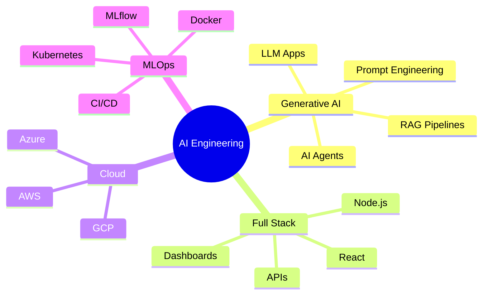
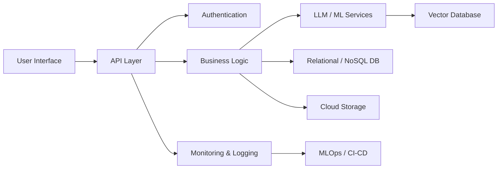

# 🚀 Pavan Kishore Vaddi

### Full Stack AI Engineer | Generative AI | LLMs | RAG | LangGraph | MLOps

 

---

## 👨‍💻 About Me

I am a Full Stack AI Engineer focused on building enterprise-grade AI platforms, Generative AI applications, LLM-powered systems, RAG pipelines, cloud-native applications, and scalable MLOps workflows.

- 🔭 Building AI agents, multi-agent systems, and enterprise GenAI applications  
- 🤖 Working with LLMs, RAG, LangChain, LangGraph, Vector Databases, and prompt engineering  
- ☁️ Experienced with AWS, Azure, GCP, cloud AI services, and production deployments  
- 🧠 Strong background in machine learning, NLP, automation, and full-stack development  
- ⚙️ Focused on scalable architecture, clean code, APIs, CI/CD, and MLOps  
- 📫 Email: **pavankishorevaddi@gmail.com**  
- 🌐 LinkedIn: **www.linkedin.com/in/pavnkv**

---

## 🧠 Current Focus

---

## 🛠 Technology Stack

### Languages & Backend

### Frontend

### AI / ML / GenAI

### Cloud, DevOps & MLOps

### Databases

---

## 📊 GitHub Analytics

 

 

---

## 🐍 Contribution Snake

---

## 🏆 GitHub Trophies

  

---

## 🚀 Featured Project Portfolio

| Project | Description | Tech Stack |
|---|---|---|
| **AI Resume Matcher** | LLM-powered resume screening and ranking platform | Python, OpenAI, LangChain, Vector DB |
| **Enterprise RAG Assistant** | Document intelligence platform for enterprise knowledge search | RAG, OpenAI, LangChain, FAISS/Pinecone |
| **Multi-Agent Recruiter Assistant** | Recruiting workflow automation using AI agents | LangGraph, CrewAI, FastAPI |
| **Timesheet Management Platform** | Full-stack admin and employee timesheet application | React, Node.js, Express, MongoDB |
| **AI Governance Framework** | Responsible AI, model risk, governance, and compliance framework | Python, Policy AI, Risk Controls |
| **MLOps Pipeline** | Model training, tracking, deployment, and monitoring pipeline | Docker, Kubernetes, MLflow, GitHub Actions |

---

## 🏗 Architecture Style

---

## 📌 Recommended Repositories To Pin

1. `ai-resume-matcher`
2. `enterprise-rag-assistant`
3. `multi-agent-recruiter-assistant`
4. `timesheet-management-system`
5. `ai-governance-framework`
6. `mlops-pipeline`

---

## 💼 Open To Opportunities

**AI/ML Engineer | Generative AI Engineer | Full Stack AI Engineer | LLM Engineer | MLOps Engineer**

📍 United States  
📧 **vaddip17@gmail.com**  
🔗 **www.linkedin.com/in/pavan-vaddi-6820011a1**

---

## 🤝 Connect With Me

---

### ⭐ Building AI systems that are scalable, useful, and production-ready.

